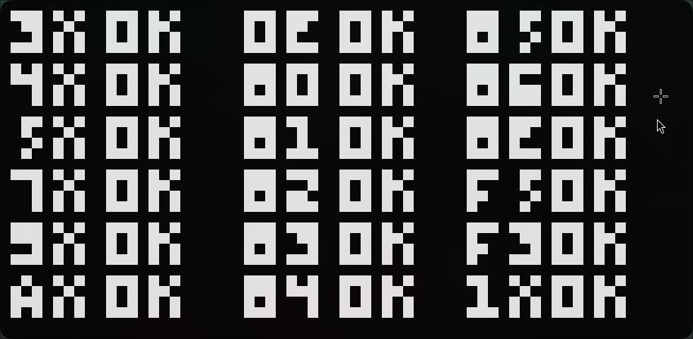

# Chip8

I made this project because I wanted to understand computers a little deeper.

Instead of staying on the level of applications and abstractions, I wanted to see what actually happens underneath: how a program is represented in memory, how a CPU keeps its state, how instructions are decoded and executed, how registers and a stack are used, and how input and a display fit into all of this.

CHIP-8 turned out to be a small enough system to actually take apart and rebuild myself.

I implemented the main parts of the machine: memory, registers, stack, timers, keyboard input, display and instruction execution.

The core of the project is the instruction cycle. The emulator reads two bytes from memory, combines them into an opcode, determines what instruction it represents, executes it, and advances the program counter. Different instruction groups handle jumps, arithmetic, drawing, keyboard input and memory operations.

I also tested the instruction implementation against opcode test ROMs to make sure the CPU state changes and instruction behavior matched the expected results.



The `64x32` display is implemented as a pixel buffer and the CHIP-8 keypad is mapped to a regular keyboard with raylib, so ROMs can actually interact with the system.

The project was mainly about understanding how these parts communicate with each other by actually implementing them, rather than just reading about CPU architecture.

The architecture of the code itself was not the main goal here. I was learning how the machine works first. Looking back, there are definitely things I would structure differently now — which eventually became the reason for the next version of this project.

### Structure

```text
Chip8
├── Core
│   ├── CPU
│   ├── Display
│   ├── Instruction
│   ├── Keyboard
│   └── FontSet
│
├── Emulator
└── ROMs
```

This project was less about building an emulator and more about using one to understand what is happening underneath the abstractions.
